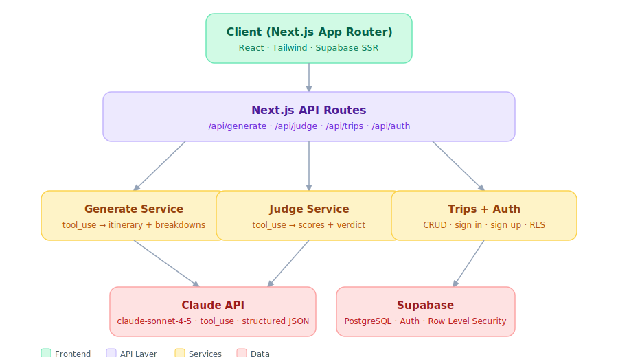

# TripMind: AI Travel Planner

**Members**: Yihan Wang, Kaichen Qu

Generates personalized travel itineraries using Claude. A single AI call produces a full day-by-day itinerary with budget, attractions, and food breakdowns. An LLM-as-judge then evaluates the result across cost accuracy, diversity, and feasibility.

---

## Features

- **AI itinerary generation**: single Claude call produces a full day-by-day plan with budget, attractions, and food breakdowns
- **Agent output view**: see budget, attractions, and food summaries from the generation step
- **LLM-as-judge**: multi-dimensional scoring (cost accuracy, diversity, feasibility) with reasoning text
- **Authentication**: email sign-up and sign-in via Supabase Auth
- **Trip history**: save, view, and re-open past itineraries per user (max 5, synced to Supabase)

---

## Tech Stack

| Layer | Technology |
|---|---|
| Framework | Next.js 15 (App Router) |
| UI | Tailwind CSS 4 |
| Fonts | DM Sans + DM Serif Display |
| State / data fetching | useState + fetch |
| AI | Anthropic Claude API (`@anthropic-ai/sdk`) |
| Database | Supabase (PostgreSQL + Auth) |
| Validation | Zod |
| CI/CD | GitHub Actions + Vercel |
| Error tracking | Sentry |
| Performance | Lighthouse CI |

---

## Architecture Diagram



## Project Structure

```
ai-travel-planner/
├── src/
│   ├── app/
│   │   ├── api/
│   │   │   ├── auth/
│   │   │   │   ├── signin/route.ts
│   │   │   │   ├── signout/route.ts
│   │   │   │   └── signup/route.ts
│   │   │   ├── generate/route.ts    ← Single Claude call → itinerary + breakdowns
│   │   │   ├── judge/route.ts       ← LLM-as-judge evaluation
│   │   │   └── trips/
│   │   │       ├── route.ts         ← List + create trips
│   │   │       └── [id]/route.ts    ← Get, update, delete trip
│   │   ├── layout.tsx
│   │   └── page.tsx
│   ├── components/
│   │   ├── TripPlanner.tsx
│   │   ├── auth/AuthModal.tsx
│   │   ├── debate/AgentDebatePanel.tsx
│   │   ├── itinerary/ItineraryTimeline.tsx
│   │   ├── judge/
│   │   │   ├── JudgeScoreCard.tsx
│   │   │   ├── ReasoningAccordion.tsx
│   │   │   └── ScoreBar.tsx
│   │   ├── layout/
│   │   │   ├── Sidebar.tsx
│   │   │   ├── Topbar.tsx
│   │   │   └── TripInputForm.tsx
│   │   └── trips/MyTripsPanel.tsx
│   ├── lib/
│   │   └── supabase/
│   │       ├── client.ts            ← Supabase browser client
│   │       └── server.ts            ← Supabase server client (SSR)
│   └── services/
│       ├── generateService.ts       ← Claude tool_use call
│       ├── judgeService.ts          ← Judge scoring logic
│       └── prompts/
│           ├── generatePrompt.ts
│           └── judgePrompt.ts
├── docs/
│   ├── architecture.jpg
│   ├── claude/
│   │   ├── architecture.md
│   │   ├── conventions.md
│   │   ├── skills.md
│   │   └── testing.md
│   └── TripagentPRD.pdf
├── .claude/
│   ├── settings.json                ← Hooks: PreToolUse, PostToolUse, Stop
│   └── skills/
│       ├── add-feature.md
│       └── fix-issue.md
├── .github/
│   └── workflows/
│       ├── ci.yml                   ← Lint, type-check, tests, security scan
│       └── ai-review.yml            ← AI PR review via claude-code-action
├── .mcp.json                        ← GitHub MCP server
├── CLAUDE.md
└── README.md
```

---

## Getting Started

### Prerequisites

- Node.js 20+
- A Supabase project (free tier works)
- An Anthropic API key

### 1. Clone and install

```bash
git clone https://github.com/arinaa77/ai-travel-planner.git
cd ai-travel-planner
npm install
```

### 2. Environment variables

```bash
cp .env.example .env.local
```

Fill in `.env.local`:

```env
# Supabase
NEXT_PUBLIC_SUPABASE_URL=your_supabase_url
NEXT_PUBLIC_SUPABASE_ANON_KEY=your_anon_key
SUPABASE_SERVICE_ROLE_KEY=your_service_role_key

# Anthropic
ANTHROPIC_API_KEY=your_anthropic_key

# App
NEXT_PUBLIC_APP_URL=http://localhost:3000
```

### 3. Database setup

Run the SQL migrations via the Supabase dashboard SQL editor, or using the Supabase CLI:

```bash
npx supabase db push
```

### 4. Run locally

```bash
npm run dev
```

Open [http://localhost:3000](http://localhost:3000).

---

## Architecture

### Generation Pattern

```typescript
// src/services/generateService.ts
// Single Claude call returns itinerary + agent panel data in one structured response
const result = await generateTrip({ destination, days, budget, style });
// result.itinerary    → ItineraryDay[]
// result.agentOutputs → budget / attractions / food breakdowns for the panel
```

Uses `client.messages.create` with `tool_use` + `tool_choice: { type: "auto" }` for structured JSON output. No streaming.

### Database

Supabase via `@supabase/supabase-js` directly: no ORM. Row Level Security (RLS) enforces per-user data isolation.

Core tables: `users`, `trips`, `itinerary_versions`, `evaluations`

---

## CI/CD Pipeline

```
PR opened
  → ESLint
  → TypeScript check (tsc --noEmit)
  → Vitest unit tests
  → npm audit (no high/critical vulnerabilities)
  → AI PR review (claude-code-action)
  → Vercel preview deploy

Merge to main
  → All above +
  → Deploy to production (Vercel)
```

---

## Testing

```bash
# Unit + component tests
npm run test

# Type check
npm run type-check

# Lint
npm run lint
```

---

## Security

Key measures:

- All inputs validated via Zod at API route boundaries
- Supabase Row Level Security on all trip data
- Parameterized queries via Supabase client (no raw SQL)
- API keys in environment variables only: never client-side or `NEXT_PUBLIC_`
- `npm audit` run in CI pipeline
- `.env` files blocked from editing via Claude Code PreToolUse hook
