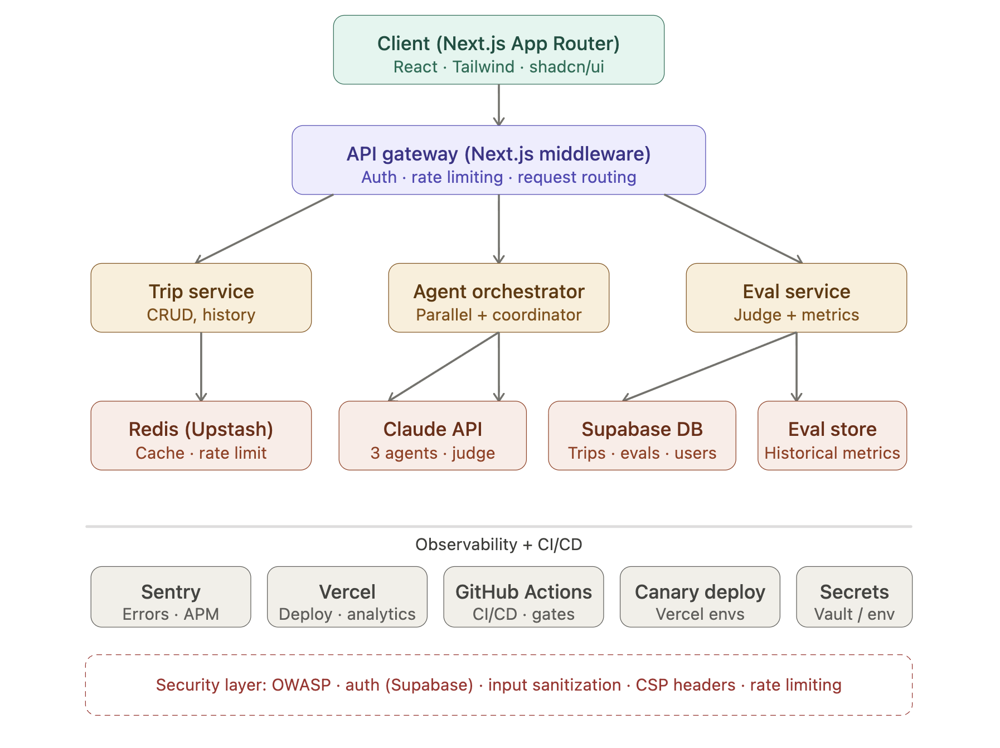

# TripAgent: AI Travel Planner

**Members**: Yihan Wang, Kaichen Qu

Generates personalized travel itineraries using a parallel multi-agent architecture. Three specialized AI agents (budget, attractions, food) run simultaneously, a coordinator merges their outputs, and an LLM-as-judge evaluates the result across multiple dimensions.

---

## Features

- **Parallel agent generation**: budget, attractions, and food agents run concurrently via `Promise.all()`
- **Agent debate view**: see each agent's raw plan before the coordinator merges them
- **LLM-as-judge**: multi-dimensional scoring (cost accuracy, diversity, feasibility) with reasoning text
- **Day remix**: regenerate a single day without rerunning the whole trip
- **Destination compare**: run parallel evals across two cities and pick the better fit
- **Eval history dashboard**: track score trends across all generated trips
- **Trip history**: save, view, and re-open past itineraries per user

---

## Tech Stack

| Layer | Technology |
|---|---|
| Framework | Next.js 14 (App Router) |
| UI | Tailwind CSS + shadcn/ui |
| Fonts | DM Sans + DM Serif Display |
| State / data fetching | TanStack Query |
| AI | Anthropic Claude API |
| Database | Supabase (PostgreSQL + Auth) |
| Validation | Zod |
| CI/CD | GitHub Actions + Vercel |
| Error tracking | Sentry |
| Performance | Lighthouse CI |
| Uptime | Better Uptime |

---

## Architecture Diagram



## Project Structure

```
ai-travel-planner/
├── src/
│   ├── app/                    # Next.js App Router pages
│   │   ├── (auth)/             # Login / signup routes
│   │   ├── dashboard/          # Trip history + eval dashboard
│   │   ├── trips/[id]/         # Individual trip view
│   │   └── api/
│   │       ├── generate/       # Orchestrates parallel agents
│   │       ├── judge/          # LLM-as-judge evaluation
│   │       ├── trips/          # CRUD for saved trips
│   │       └── evals/          # Eval history endpoints
│   ├── services/
│   │   ├── agentOrchestrator.ts   # Promise.all() agent runner
│   │   ├── coordinatorAgent.ts    # Merges 3 agent outputs
│   │   ├── judgeService.ts        # LLM judge + scoring
│   │   └── tripService.ts         # Trip CRUD business logic
│   ├── components/
│   │   ├── AgentDebatePanel.tsx   # Live agent output cards
│   │   ├── ItineraryTimeline.tsx  # Day-by-day timeline view
│   │   ├── JudgeScoreCard.tsx     # Score + reasoning display
│   │   └── TripInputForm.tsx      # Destination/budget form
│   ├── lib/
│   │   ├── supabase.ts         # Supabase client singleton
│   │   └── validators.ts       # Zod schemas
│   └── middleware.ts           # Auth + rate limiting (API gateway)
├── docs/
│   ├── PRD.docx                # Product Requirements Document
│   ├── architecture.md         # Architecture decision log
│   └── security-audit.md       # OWASP audit results
├── .github/
│   └── workflows/
│       ├── ci.yml              # Lint, test, Lighthouse CI
│       └── deploy.yml          # Staging + production deploy
├── CLAUDE.md                   # Claude Code context file
└── README.md
```

---

## Getting Started

### Prerequisites

- Node.js 20+
- A Supabase project (free tier works)
- An Anthropic API key

### 1. Clone and install

```bash
git clone https://github.com/arinaa77/ai-travel-planner.git
cd ai-travel-planner
npm install
```

### 2. Environment variables

```bash
cp .env.example .env.local
```

Fill in `.env.local`:

```env
# Supabase
NEXT_PUBLIC_SUPABASE_URL=your_supabase_url
NEXT_PUBLIC_SUPABASE_ANON_KEY=your_anon_key
SUPABASE_SERVICE_ROLE_KEY=your_service_role_key

# Anthropic
ANTHROPIC_API_KEY=your_anthropic_key

# App
NEXT_PUBLIC_APP_URL=http://localhost:3000
```

### 3. Database setup

Run the SQL migrations in `supabase/migrations/` via the Supabase dashboard SQL editor, or using the Supabase CLI:

```bash
npx supabase db push
```

### 4. Run locally

```bash
npm run dev
```

Open [http://localhost:3000](http://localhost:3000).

---

## Architecture

### API Gateway

`middleware.ts` intercepts all `/api/*` requests and handles:
- JWT verification via Supabase Auth
- Rate limiting (10 req/min per user on `/api/generate`)
- Request logging for Sentry

### Parallel Agent Pattern

```typescript
// src/services/agentOrchestrator.ts
const [budget, attractions, food] = await Promise.all([
  budgetAgent(input),
  attractionsAgent(input),
  foodAgent(input),
]);
const merged = await coordinatorAgent({ budget, attractions, food });
const evaluation = await judgeService.evaluate(merged);
```

### Database

Supabase is used directly via `@supabase/supabase-js`: no additional ORM layer. Row Level Security (RLS) policies enforce that users can only read/write their own trips.

Core tables: `users`, `trips`, `itinerary_versions`, `evaluations`

### Caching Strategy

- Next.js `unstable_cache` wraps identical destination+budget lookups (1-hour TTL)
- Supabase query checks for an existing trip before calling agents
- No Redis required

---

## CI/CD Pipeline

```
PR opened
  → ESLint + TypeScript check
  → Vitest unit tests
  → Vercel preview deploy

Merge to main
  → All above +
  → Lighthouse CI (Perf ≥ 85, A11y ≥ 90)
  → npm audit (no high/critical)
  → Deploy to staging

Tag release (v*.*.*)
  → Deploy to production (10% canary → full)
  → Sentry release tracking
```

---

## Testing

```bash
# Unit tests
npm run test

# Type check
npm run type-check

# Lint
npm run lint

# Lighthouse CI (requires staging URL)
npm run lhci
```

---

## Security

See [`docs/security-audit.md`](docs/security-audit.md) for the full OWASP Top 10 audit.

Key measures:
- All inputs validated via Zod at API route boundaries
- Supabase Row Level Security on all trip data
- Supabase parameterized queries prevent SQL injection
- CSP headers configured in `next.config.js`
- API keys in environment variables only: never client-side
- `npm audit` run in CI pipeline

---

## Monitoring

- **Sentry**: error tracking and APM
- **Vercel Analytics**: Web Vitals and page performance
- **Better Uptime**: uptime monitoring with Slack alerts
